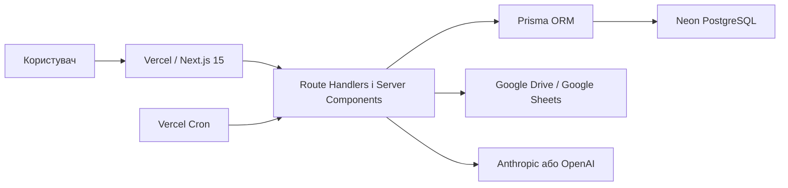

# MXMT Analytics

AI-платформа для управління асортиментом, запасами, продажами та маркетингом у fashion retail.

Проєкт працює як мультитенантний Next.js застосунок:

- застосунок і API розгортаються на **Vercel**;
- основна PostgreSQL база працює в **Neon**;
- доступ до БД виконується через Prisma ORM;
- операційні дані імпортуються з Google Sheets;
- управлінські звіти розраховуються всередині MXMT і зберігаються в Neon;
- AI-агенти підтримують Anthropic і OpenAI.

> Railway більше не використовується. У репозиторії немає Railway-конфігурації, а production runtime розрахований на Vercel Functions і Neon PostgreSQL.

## Зміст

1. [Можливості](#можливості)
2. [Архітектура](#архітектура)
3. [Технологічний стек](#технологічний-стек)
4. [Структура репозиторію](#структура-репозиторію)
5. [Локальний запуск](#локальний-запуск)
6. [Змінні середовища](#змінні-середовища)
7. [Neon PostgreSQL і Prisma](#neon-postgresql-і-prisma)
8. [Деплой на Vercel](#деплой-на-vercel)
9. [Щоденний імпорт Google Sheets](#щоденний-імпорт-google-sheets)
10. [Дані та звіти](#дані-та-звіти)
11. [AI-агенти](#ai-агенти)
12. [Автентифікація та ролі](#автентифікація-та-ролі)
13. [Тестування](#тестування)
14. [Production release checklist](#production-release-checklist)
15. [Діагностика](#діагностика)
16. [Додаткова документація](#додаткова-документація)

## Можливості

| Модуль | URL | Призначення |
| --- | --- | --- |
| Дашборд | `/dashboard` | KPI, продажі, стокаути та стан синхронізації |
| AI-агенти | `/agents` | Pipeline з 9 агентів, симуляції, трасування та експорт |
| Маркетинговий календар | `/calendar` | Події, кампанії, залишки й AI-планування |
| Агент-аналітик | `/analyst` | Класифікація SKU, фільтри та AI-аналіз |
| Асортимент | `/assortment` | Каталоги, бренди, бюджет, кошик і замовлення |
| Дані та звіти | `/data-reporting` | 5 вкладок даних, імпорт, перерахунок, пошук і колонки |
| Налаштування | `/settings` | Онбординг, Google Drive та AI-провайдери |

Інтерфейс підтримує українську й англійську мови, світлу та темну теми.

## Архітектура



### Ключові принципи

- **Один Next.js застосунок:** frontend, server rendering та API routes розгортаються разом на Vercel.
- **Мультитенантність:** бізнес-дані ізольовані через `tenantId` у БД та серверних API.
- **Server-only secrets:** ключі БД, JWT, Google і AI ніколи не передаються клієнту.
- **Математика поза AI:** WOH, STR, GM, продажі та агрегати розраховує код і PostgreSQL; AI інтерпретує готові метрики.
- **Ідемпотентний pipeline:** однаковий файл не створює повторні snapshots і повторні розрахунки.
- **Історичність:** імпорти та розрахунки не перезаписуються; активний запуск обирається через `DataSource.activeImportRunId`.

## Технологічний стек

| Компонент | Технологія |
| --- | --- |
| Web framework | Next.js 15, App Router, React 19 |
| Мова | TypeScript |
| Hosting | Vercel |
| Database | Neon PostgreSQL |
| ORM | Prisma 5 |
| Styling | Tailwind CSS |
| Auth | JWT у httpOnly cookies, `jose`, `bcryptjs` |
| AI | Anthropic SDK, OpenAI SDK |
| Табличні файли | SheetJS (`xlsx`) |
| Тести | Vitest |

## Структура репозиторію

```text
app/
  (app)/                 захищені сторінки застосунку
  (auth)/                login і register
  api/                   Next.js Route Handlers
components/              UI та клієнтська orchestration
lib/                     бізнес-логіка, auth, AI, імпорт і звіти
prisma/
  schema.prisma          схема Neon PostgreSQL
  migrations/            versioned production migrations
tests/                   unit та contract tests
docs/                    технічні контракти й runbooks
middleware.ts            перевірка сесії для захищених маршрутів
vercel.json              Vercel Cron configuration
.env.example             шаблон змінних середовища
```

## Локальний запуск

### Вимоги

- Node.js 20 LTS або новіший сумісний runtime;
- npm;
- Neon PostgreSQL database або локальний PostgreSQL;
- доступ до Google-файлу для перевірки імпорту;
- ключ Anthropic або OpenAI для AI-функцій.

### Встановлення

```bash
git clone <repository-url>
cd mxmt
npm install
cp .env.example .env
```

Заповніть `.env`, після чого застосуйте міграції та запустіть застосунок:

```bash
npm run db:migrate:deploy
npm run dev
```

Локальна адреса за замовчуванням: `http://localhost:3000`.

### Команди

| Команда | Призначення |
| --- | --- |
| `npm run dev` | Next.js development server |
| `npm run build` | Prisma Client generation і production build |
| `npm run start` | Запуск зібраного Next.js застосунку |
| `npm test` | Всі Vitest тести |
| `npm run test:watch` | Тести в watch mode |
| `npm run db:migrate` | Створення/застосування міграції у development |
| `npm run db:migrate:deploy` | Застосування готових міграцій у staging/production |
| `npm run db:push` | Синхронізація schema без migration history; лише для тимчасової локальної розробки |

## Змінні середовища

Актуальний шаблон знаходиться у [`.env.example`](./.env.example).

### Обов'язкові

| Змінна | Призначення |
| --- | --- |
| `DATABASE_URL` | Pooled Neon connection string для Prisma Client у Vercel Functions |
| `DIRECT_URL` | Direct Neon connection string для Prisma Migrate та admin tooling |
| `JWT_ACCESS_SECRET` | Підпис короткоживучого access token |
| `JWT_REFRESH_SECRET` | Підпис refresh token |
| `CRON_SECRET` | Авторизація Vercel Cron; щонайменше 16 випадкових символів |
| `GOOGLE_DRIVE_FILE_ID` | ID основного Google Sheets/Drive файлу |
| `NEXT_PUBLIC_APP_URL` | Production URL застосунку |

### AI

| Змінна | Призначення |
| --- | --- |
| `AI_PROVIDER` | `anthropic` або `openai` |
| `AI_TIMEOUT_MS` | Timeout AI-запиту в мілісекундах |
| `ANTHROPIC_API_KEY` | Ключ Anthropic |
| `OPENAI_API_KEY` | Ключ OpenAI |

Потрібен щонайменше один ключ для обраного провайдера. Користувацькі налаштування можуть перевизначати провайдера для окремого агента.

### Google

| Змінна | Призначення |
| --- | --- |
| `GOOGLE_SERVICE_ACCOUNT_KEY` | Необов'язковий base64 JSON Service Account для приватних файлів |
| `GOOGLE_DRIVE_EXPORT_FOLDER_ID` | Необов'язкова папка для server-side Google Sheets exports |

Якщо Service Account не налаштовано, вихідний файл має бути доступний за посиланням для читання.

### Правила безпеки

- Не комітьте `.env`, connection strings, JWT secrets або API keys.
- Не додавайте секрети з префіксом `NEXT_PUBLIC_`.
- Після зміни environment variables у Vercel створіть новий deployment: зміни не застосовуються до вже розгорнутих версій.

## Neon PostgreSQL і Prisma

`prisma/schema.prisma` використовує два підключення:

```prisma
datasource db {
  provider  = "postgresql"
  url       = env("DATABASE_URL")
  directUrl = env("DIRECT_URL")
}
```

### Підключення

- `DATABASE_URL` повинен містити pooled hostname Neon з суфіксом `-pooler`.
- `DIRECT_URL` використовує direct hostname без `-pooler`.
- Обидва URL повинні використовувати TLS, наприклад `sslmode=require`.

Pooled URL потрібен serverless runtime Vercel, де може одночасно працювати багато короткоживучих functions. Direct URL залишений для migration та адміністративних операцій.

Офіційна документація: [Neon connection pooling](https://neon.com/docs/connect/connection-pooling).

### Міграції

Історія міграцій зберігається в `prisma/migrations` і не повинна редагуватися після застосування до production.

Development:

```bash
npm run db:migrate -- --name describe_change
```

Production або staging:

```bash
npm run db:migrate:deploy
```

`prisma migrate deploy` застосовує лише pending migrations. Не використовуйте `prisma migrate reset` або `db push` для production Neon.

Офіційна документація: [Prisma migrate deploy](https://www.prisma.io/docs/cli/migrate/deploy).

### Поточні production migrations

```text
20260715000000_baseline
20260717000000_data_reliability_constraints
20260719000000_agent_run_lock
20260827000000_data_import_reporting_schema
```

## Деплой на Vercel

### Git deployment

Рекомендований production flow:

1. Підключити GitHub repository до Vercel.
2. Обрати `main` як Production Branch.
3. Framework Preset: `Next.js`.
4. Додати змінні середовища для Production; за потреби окремі значення для Preview.
5. До deployment застосувати pending Prisma migrations до Neon.
6. Merge перевіреної feature branch у `main` запускає production deployment.

Vercel автоматично визначає команди з `package.json`. Production build у цьому проєкті:

```bash
npm run build
```

Він виконує `prisma generate`, а потім `next build`. Міграції не запускаються всередині кожного Vercel Function startup.

Environment variables діють лише для нових deployments. Див. [Vercel Environment Variables](https://vercel.com/docs/environment-variables).

### CLI deployment

Для ручного preview або production deployment:

```bash
npx vercel
npx vercel --prod
```

Git-based deployment залишається основним production workflow.

### Health check

Після deployment перевірте:

```text
GET /api/health
```

Також перевірте Vercel Runtime Logs на помилки Prisma, auth, AI та scheduled import.

## Щоденний імпорт Google Sheets

Production pipeline запускається щодня у часовому вікні `07:00–07:59 Europe/Kyiv`.

Vercel Cron використовує UTC, а Київ переходить між UTC+2 та UTC+3. Тому `vercel.json` містить два щоденні slots:

```json
{
  "crons": [
    { "path": "/api/cron/data-import/utc-04", "schedule": "0 4 * * *" },
    { "path": "/api/cron/data-import/utc-05", "schedule": "0 5 * * *" }
  ]
}
```

Обидва endpoints перевіряють локальну київську годину. Невідповідний DST slot повертає успішну відповідь зі `skipped: true`, тому pipeline виконується один раз.

`CRON_SECRET` передається Vercel як Bearer token. Endpoint відхиляє запити з відсутнім або неправильним секретом. Cron jobs активуються лише після production deployment.

Офіційна документація: [Vercel Cron Jobs](https://vercel.com/docs/cron-jobs) і [Managing Cron Jobs](https://vercel.com/docs/cron-jobs/manage-cron-jobs).

### Перший запуск

До активації cron адміністратор повинен виконати перший імпорт на сторінці `/data-reporting`. Він створить tenant-specific `DataSource`, який надалі знайде scheduler.

### Ручна перевірка cron

```bash
curl --fail --request POST \
  --header "Authorization: Bearer $CRON_SECRET" \
  "https://your-production-domain.example/api/cron/data-import?force=1"
```

`force=1` обходить лише перевірку локальної години, але не авторизацію.

## Дані та звіти

Сторінка `/data-reporting` містить п'ять вкладок:

| Вкладка | Тип |
| --- | --- |
| `Product YML 2.0` | Raw source snapshot і typed products |
| `ZAVOD_API` | Raw transactions і normalized sale lines |
| `ARTICLE REPORT` | Розрахунок на рівні товару |
| `BY BRAND` | Агрегація ARTICLE REPORT за брендом |
| `BY CATEGORY` | Агрегація ARTICLE REPORT за категорією |

Для кожної вкладки доступні pagination, search, sorting і вибір видимих колонок. Налаштування колонок зберігаються окремо для користувача та вкладки.

### Pipeline

1. Завантажує XLSX export Google Sheets.
2. Перевіряє allowlist вкладок, headers, розмір і рядки.
3. Зберігає raw snapshots для аудиту.
4. Нормалізує products і transaction lines.
5. Активує новий import atomically, якщо немає blocking errors.
6. Розраховує `ARTICLE REPORT` для обраного `Date From` / `Date To`.
7. Агрегує результати в `BY BRAND` і `BY CATEGORY`.
8. Зберігає issues, warnings, статистику й immutable calculation results у Neon.

Однаковий вміст workbook дає `importOutcome: "unchanged"`; розрахунок з тим самим cache identity дає `calculationOutcome: "cached"`.

### Основні endpoints

| Endpoint | Мінімальна роль | Призначення |
| --- | --- | --- |
| `POST /api/data/import` | `ADMIN` | Імпорт і автоматичний розрахунок |
| `POST /api/data/calculate` | `ANALYST` | Перерахунок активного або історичного імпорту |
| `GET /api/data/status` | authenticated | Джерело, активний імпорт, calculation та issues |
| `GET /api/data/issues` | authenticated | Diagnostics з pagination і filters |
| `GET /api/data/tables/{sheetKey}` | authenticated | Дані конкретної вкладки |
| `GET/PUT /api/data/preferences/{sheetKey}` | authenticated | Налаштування таблиці користувача |

Детальні контракти: [`docs/data-import-contract.md`](./docs/data-import-contract.md) і [`docs/data-reporting-api.md`](./docs/data-reporting-api.md).

## AI-агенти

Pipeline містить 9 агентів:

1. Inventory Analyst
2. Channel Analytics
3. Product Attributes
4. Repricing Strategy
5. Reordering Strategy
6. Commercial Marketer
7. Calendar Agent
8. Campaign Analysis
9. Weekly Report

Кожен запуск зберігається в `AgentRun`. Для одного `tenantId + agentType` дозволений лише один активний `running` запуск. Результат містить structured output і debug metadata для трасування.

Provider resolution:

```text
налаштування конкретного агента → AI_PROVIDER → anthropic fallback
```

AI routes виконуються тільки на сервері. Клієнт отримує результат, але не API key.

Детальніше: [`docs/ai-agents-runbook.md`](./docs/ai-agents-runbook.md).

## Автентифікація та ролі

Система використовує короткоживучий access token і refresh token у httpOnly cookies. `middleware.ts` захищає application routes, а API повторно перевіряють користувача та роль.

| Роль | Загальне призначення |
| --- | --- |
| `VIEWER` | Перегляд дозволених даних |
| `ANALYST` | Аналітика та перерахунок звітів |
| `ADMIN` | Імпорт, налаштування та tenant operations |
| `SUPER_ADMIN` | Повний адміністративний доступ |

API не приймає `tenantId` від клієнта для data-reporting operations — tenant визначається з authenticated session.

## Тестування

Перед merge або production deployment виконайте:

```bash
npm test
npm run build
```

Тести знаходяться у `tests/**/*.test.ts` і перевіряють:

- auth та API contracts;
- AI provider/output handling;
- import parsing, normalization та idempotency;
- ARTICLE REPORT formulas;
- BY BRAND / BY CATEGORY aggregation;
- scheduler, timezone та cron authorization;
- data table API й UI helpers.

Unit tests не повинні звертатися до real AI providers або змінювати production database.

Детальніше: [`docs/testing.md`](./docs/testing.md).

## Production release checklist

Перед merge у `main`:

- [ ] `npm test` проходить;
- [ ] `npm run build` проходить;
- [ ] migration files закомічені;
- [ ] `prisma migrate deploy` застосовано до потрібної Neon branch/database;
- [ ] Vercel Production variables налаштовані;
- [ ] Preview не використовує production secrets без необхідності;
- [ ] `CRON_SECRET` має щонайменше 16 випадкових символів;
- [ ] Google source доступний production runtime;
- [ ] формули або data contract зміни мають нову `calculationVersion`;
- [ ] release не містить `.env`, credentials або exported customer data.

Після deployment:

- [ ] `/api/health` повертає успішний status;
- [ ] login і refresh session працюють;
- [ ] `/data-reporting` показує всі 5 вкладок;
- [ ] Vercel Cron Jobs відображають обидва UTC slots;
- [ ] перший scheduled run перевірений у Vercel Runtime Logs;
- [ ] active import і report calculation не мають статусу `FAILED`.

## Діагностика

### Prisma не підключається у Vercel

1. Перевірте, що `DATABASE_URL` — pooled Neon URL з `-pooler`.
2. Перевірте `sslmode=require`.
3. Переконайтеся, що змінна додана саме до потрібного Vercel Environment.
4. Redeploy після зміни variables.

### Міграція не застосовується

1. Перевірте direct `DIRECT_URL`.
2. Запустіть `npx prisma migrate status`.
3. Перевірте migration history; не редагуйте вже застосовані migration files.
4. Застосуйте `npm run db:migrate:deploy`.

### Cron не запускається

1. Перевірте `CRON_SECRET` у Production.
2. Перевірте `vercel.json` і redeploy.
3. Відкрийте **Vercel → Project → Settings → Cron Jobs**.
4. Перевірте Runtime Logs обох DST slots.
5. Пам'ятайте, що один із двох slots повинен повертати `skipped: true`.

### Імпорт повернув `WARNING`

`WARNING` не означає rollback. Перевірте `/api/data/issues` або картку issues у `/data-reporting`. Unmatched transactions, пропущені optional fields і negative metrics зберігаються як diagnostics.

### AI-агент завис у `running`

Перевірте `/api/health`, Vercel logs і останній `AgentRun`. Recovery procedure описана в [`docs/ai-agents-runbook.md`](./docs/ai-agents-runbook.md).

## Додаткова документація

| Документ | Призначення |
| --- | --- |
| [`docs/data-import-contract.md`](./docs/data-import-contract.md) | Джерела, identity, formulas і acceptance criteria |
| [`docs/data-reporting-api.md`](./docs/data-reporting-api.md) | Data/reporting API contract |
| [`docs/scheduled-data-import.md`](./docs/scheduled-data-import.md) | Vercel Cron і Kyiv DST |
| [`docs/data-reliability-runbook.md`](./docs/data-reliability-runbook.md) | Імпорт, rollback і recovery |
| [`docs/data-release-verification.md`](./docs/data-release-verification.md) | Перевірка Neon migration, pipeline та UI |
| [`docs/ai-agents-runbook.md`](./docs/ai-agents-runbook.md) | AI runtime і recovery |
| [`docs/api-contracts.md`](./docs/api-contracts.md) | Загальні API conventions |
| [`docs/frontend-architecture.md`](./docs/frontend-architecture.md) | Frontend boundaries і performance rules |
| [`docs/testing.md`](./docs/testing.md) | Testing workflow |

## Ліцензія та доступ

Проєкт приватний. Код, credentials, production data та customer exports не повинні поширюватися поза авторизованою командою.
