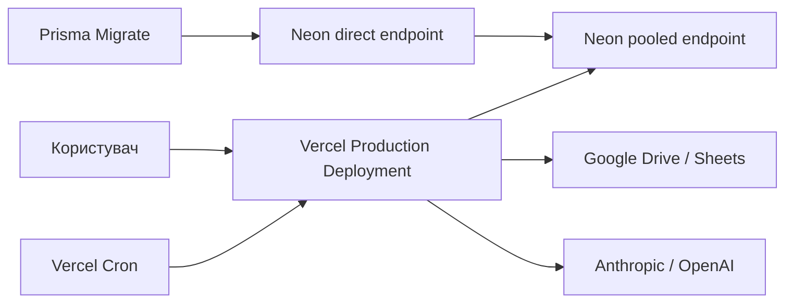

# MXMT Analytics — Production Runbook

Операційна інструкція для production-середовища MXMT Analytics.

Актуальна інфраструктура:

- **Vercel** — Next.js application, API routes, Middleware і Cron;
- **Neon PostgreSQL** — production database;
- **Prisma ORM** — runtime queries і schema migrations;
- **Google Drive / Google Sheets** — операційне джерело даних;
- **Anthropic / OpenAI** — AI providers.

> Railway більше не використовується. Не застосовуйте Railway deployment, variables, logs, backups або start commands до цього проєкту.

## Зміст

1. [Призначення та межі](#призначення-та-межі)
2. [Production topology](#production-topology)
3. [Доступи та секрети](#доступи-та-секрети)
4. [Щоденний operational check](#щоденний-operational-check)
5. [Health check](#health-check)
6. [Стандартний deployment](#стандартний-deployment)
7. [Prisma migrations](#prisma-migrations)
8. [Vercel Cron та щоденний імпорт](#vercel-cron-та-щоденний-імпорт)
9. [Neon backup і restore](#neon-backup-і-restore)
10. [Rollback застосунку](#rollback-застосунку)
11. [Incident response](#incident-response)
12. [Типові інциденти](#типові-інциденти)
13. [Smoke test](#smoke-test)
14. [Корисні read-only перевірки БД](#корисні-read-only-перевірки-бд)
15. [Incident record](#incident-record)
16. [Офіційні посилання](#офіційні-посилання)

## Призначення та межі

Runbook використовується для:

- production release;
- перевірки Vercel deployment і Runtime Logs;
- застосування Prisma migrations до Neon;
- контролю щоденного Google Sheets import pipeline;
- rollback application code;
- backup/restore production database;
- відновлення auth, AI agents, Drive sync і calculated reports;
- документування production incidents.

Runbook не надає дозволу на видалення production data. Будь-які destructive SQL, database restore, secret rotation або зміна production branch виконуються лише авторизованим оператором після підтвердження точного target.

## Production topology



### Production components

| Component | Source of truth | Operational surface |
| --- | --- | --- |
| Application code | GitHub `main` | Vercel Deployments |
| Runtime configuration | Vercel Production variables | Vercel Project Settings |
| Database schema | `prisma/schema.prisma` + `prisma/migrations` | Neon + Prisma CLI |
| Application data | Neon production branch | Neon Console |
| Scheduled import | `vercel.json` | Vercel Cron Jobs |
| Source workbook | Google Drive file | Google sharing / Service Account |
| AI configuration | Vercel variables + user preferences | Vercel + `/settings` |

### Runtime rules

- `DATABASE_URL` використовується Prisma Client у Vercel Functions і повинен бути pooled Neon URL.
- `DIRECT_URL` використовується для migrations/admin tooling і повинен бути direct Neon URL.
- Production branch у Vercel — `main`.
- Merge або push у `main` запускає deployment, якщо Git integration активна.
- Зміна Vercel variables не змінює вже створені deployments; потрібен redeploy.
- Database migration не повинна автоматично виконуватися під час кожного Function startup.

## Доступи та секрети

Оператор production повинен мати лише необхідні права:

- GitHub repository і protected `main`;
- Vercel project;
- Neon project/production branch;
- Google source file або Service Account;
- AI provider console за потреби.

### Production variables

| Variable | Required | Purpose |
| --- | --- | --- |
| `DATABASE_URL` | так | Pooled Neon runtime connection |
| `DIRECT_URL` | так | Direct Neon migration connection |
| `JWT_ACCESS_SECRET` | так | Access token signing |
| `JWT_REFRESH_SECRET` | так | Refresh token signing |
| `CRON_SECRET` | так | Vercel Cron Bearer authorization |
| `GOOGLE_DRIVE_FILE_ID` | так | Source workbook |
| `GOOGLE_SERVICE_ACCOUNT_KEY` | для private source | Base64 Service Account JSON |
| `GOOGLE_DRIVE_EXPORT_FOLDER_ID` | optional | Server-side Sheets exports |
| `AI_PROVIDER` | так для AI | `anthropic` або `openai` |
| `AI_TIMEOUT_MS` | рекомендовано | AI request timeout |
| `ANTHROPIC_API_KEY` | за provider | Anthropic API |
| `OPENAI_API_KEY` | за provider | OpenAI API |
| `NEXT_PUBLIC_APP_URL` | так | Production application URL |

### Secret handling

- Не вставляйте values у tickets, commits, screenshots або incident notes.
- Не використовуйте production secrets у Preview без явної потреби.
- Не додавайте server secrets з префіксом `NEXT_PUBLIC_`.
- Після rotation оновіть Vercel variables і створіть новий deployment.
- Rotation JWT secrets завершує існуючі sessions; плануйте її як user-visible change.
- Після компрометації Service Account key відкличте старий key у Google, а не лише замініть value у Vercel.

## Щоденний operational check

Рекомендована щоденна перевірка після 08:00 `Europe/Kyiv`:

1. Відкрити production `/api/health`.
2. Перевірити Vercel Runtime Logs за останній cron window.
3. На `/data-reporting` перевірити:
   - timestamp останнього імпорту;
   - status active import;
   - status report calculation;
   - кількість issues;
   - доступність п'яти tabs.
4. У Vercel Cron Jobs переконатися, що обидва DST slots активні.
5. Якщо status `WARNING`, переглянути `/api/data/issues`; `WARNING` не дорівнює failed import.
6. Якщо імпорт не оновився, перейти до [Vercel Cron та щоденний імпорт](#vercel-cron-та-щоденний-імпорт).

## Health check

Endpoint:

```text
GET /api/health
```

Healthy або degraded database-connected response повертає HTTP 200:

```json
{
  "ok": true,
  "status": "healthy",
  "checks": {
    "app": "ok",
    "database": "ok",
    "data": {
      "status": "ok",
      "issues": []
    }
  },
  "requestId": "...",
  "durationMs": 123,
  "environment": "production",
  "timestamp": "..."
}
```

### `healthy`

- application відповідає;
- `SELECT 1` до Neon успішний;
- data health checks не знайшли відхилень.

### `degraded`

HTTP 200, але `checks.data.issues` містить одну або більше проблем:

- `negative_inventory_quantities`;
- `negative_sales_values`;
- `stale_drive_syncs`;
- `stale_agent_runs`;
- `catalog_item_count_mismatches`.

`degraded` потребує розслідування, але не завжди потребує rollback deployment.

### `unhealthy`

HTTP 503 означає, що database check не пройшов. Перевірте:

1. Vercel Runtime Logs за `requestId`;
2. Neon project/compute status;
3. `DATABASE_URL` у Vercel Production;
4. Neon pooled hostname і TLS parameters;
5. connection limits і довгі queries;
6. останню migration/restore operation.

## Стандартний deployment

### Перед release

1. Переконатися, що feature branch синхронізована з `main`.
2. Перевірити diff на secrets, `.env`, customer exports і destructive SQL.
3. Виконати:

```bash
npm install
npm test
npm run build
```

4. Якщо змінювалася Prisma schema:
   - migration file створений;
   - SQL review виконаний;
   - backup/restore point підготовлений;
   - migration перевірена на staging/Neon branch;
   - application і schema backward-compatible на час rollout.
5. Якщо змінювався data contract або formulas, перевірити `calculationVersion`.
6. Якщо змінювався cron, перевірити `vercel.json` і local Kyiv gate tests.

### Release sequence

Безпечна послідовність:

1. Створити Neon restore point/snapshot або зафіксувати PITR timestamp для ризикової зміни.
2. Застосувати backward-compatible pending migrations.
3. Merge перевіреної branch у `main`.
4. Дочекатися successful Vercel production build.
5. Перевірити deployment URL до/після production promotion, якщо workflow використовує manual promotion.
6. Виконати smoke test.
7. Переглянути Runtime Logs і `/api/health`.
8. Зафіксувати commit SHA, Vercel deployment ID і migration names.

### Vercel verification

У Vercel перевірте:

- Build status: `Ready`;
- Environment: `Production`;
- Git branch/commit: очікуваний `main` SHA;
- Functions не мають нових 5xx;
- Middleware не створює redirect loop;
- Cron configuration відповідає `vercel.json`.

CLI-перевірка, якщо Vercel CLI linked:

```bash
npx vercel list --prod
npx vercel logs --environment production
```

## Prisma migrations

### Створення migration у development

Після зміни `prisma/schema.prisma`:

```bash
npm run db:migrate -- --name describe_change
```

Перевірте generated SQL у `prisma/migrations/<timestamp>_describe_change/migration.sql`.

### Перевірка status

```bash
npx prisma migrate status
```

### Production apply

```bash
npm run db:migrate:deploy
```

Production migration використовує `DIRECT_URL` з `prisma/schema.prisma`.

### Заборонені production операції

Не запускайте без окремого recovery plan:

```text
prisma migrate reset
prisma db push
DROP DATABASE
DROP SCHEMA
TRUNCATE ... CASCADE
```

### Migration failure

1. Не повторюйте випадкові commands.
2. Збережіть повний Prisma error і migration name.
3. Виконайте `npx prisma migrate status`.
4. Перевірте Neon Operations і Postgres logs.
5. Визначте, чи migration:
   - не почалася;
   - rollback-нулась транзакційно;
   - частково змінила schema/data;
   - позначена failed у `_prisma_migrations`.
6. Не редагуйте вже застосований migration file.
7. Для production надавайте перевагу forward-fix migration.
8. `prisma migrate resolve` використовуйте лише після ручної перевірки фактичного стану schema.

### Expand/contract для ризикових змін

Для rename/drop колонок:

1. Expand: додати нову nullable schema без видалення старої.
2. Deploy code, який підтримує обидві версії.
3. Backfill і перевірити дані.
4. Переключити reads/writes.
5. Contract: видалити стару schema окремою migration після стабілізації.

Це дозволяє виконати Vercel application rollback без несумісності зі schema.

## Vercel Cron та щоденний імпорт

Production import повинен виконуватися щодня у вікні `07:00–07:59 Europe/Kyiv`.

`vercel.json` містить два UTC slots:

```text
04:00 UTC → 07:00 Kyiv під час daylight-saving time
05:00 UTC → 07:00 Kyiv під час standard time
```

Routes:

```text
GET /api/cron/data-import/utc-04
GET /api/cron/data-import/utc-05
POST /api/cron/data-import?force=1
```

Обидва GET routes проходять local-time gate. Невідповідний slot повертає:

```json
{
  "ok": true,
  "skipped": true,
  "reason": "outside_schedule_window"
}
```

### Очікуваний successful run

```json
{
  "ok": true,
  "skipped": false,
  "tenants": {
    "total": 1,
    "succeeded": 1,
    "failed": 0
  }
}
```

Повторна доставка cron event без зміни workbook повинна завершитися idempotently:

```text
importOutcome: unchanged
calculationOutcome: cached
```

### Ручний forced run

```bash
curl --fail --request POST \
  --header "Authorization: Bearer $CRON_SECRET" \
  "https://your-production-domain.example/api/cron/data-import?force=1"
```

`force=1` обходить лише schedule window. `CRON_SECRET` залишається обов'язковим.

### Cron incident checklist

1. Перевірити **Vercel → Project → Settings → Cron Jobs**.
2. Перевірити, що останній production deployment містить актуальний `vercel.json`.
3. Перевірити `CRON_SECRET` у Production і redeploy після його зміни.
4. Перевірити Runtime Logs routes `api/cron/data-import/*`.
5. Розрізняти expected `skipped: true` і real failure.
6. Перевірити `GOOGLE_DRIVE_FILE_ID` та доступ до source.
7. Перевірити duration; routes мають `maxDuration = 300`.
8. Якщо один tenant failed, переглянути `results[]` response і active import status.
9. Після усунення причини виконати один forced run.
10. Переконатися, що повтор не створив duplicate snapshots.

## Neon backup і restore

### Перед ризиковою операцією

Використайте доступний для Neon plan механізм:

- snapshot production root branch;
- instant restore/PITR restore point;
- point-in-time branch для preview;
- за потреби encrypted `pg_dump` через direct connection.

Зафіксуйте:

- Neon project і branch;
- timestamp у UTC та `Europe/Kyiv`;
- migration/deployment, перед яким створено restore point;
- відповідального оператора;
- retention/expiry тимчасового backup.

### Optional logical export

Тільки в захищене сховище:

```bash
pg_dump --format=custom --no-owner --no-acl \
  --dbname="$DIRECT_URL" \
  --file="mxmt-production-YYYYMMDD-HHMM.dump"
```

Не додавайте dump до Git і не зберігайте його на незашифрованому спільному диску.

### Restore procedure

1. Оголосити incident і за можливості зупинити writes:
   - не запускати manual imports;
   - призупинити Vercel Cron;
   - обмежити admin operations.
2. Визначити останній valid timestamp до пошкодження.
3. У Neon створити point-in-time/restore preview і **спочатку перевірити дані окремо**.
4. Перевірити schema та ключові row counts.
5. Перевірити tenant isolation і останні valid imports/calculations.
6. Лише після validation виконати restore active production branch.
7. Дочекатися завершення Neon operation; під час restore можливий короткий database disconnect.
8. Перевірити pooled і direct connections.
9. Виконати `/api/health` і smoke test.
10. Увімкнути writes і Cron.
11. Тимчасовий old/preview branch видаляти лише після завершення verification та відповідно до retention policy.

### Minimum database verification

Перевірте row counts і останні записи для:

- `Tenant`, `User`;
- `Sku`, `SalesRecord`, `InventorySnapshot`;
- `AgentRun`;
- `DataSource`, `DataImportRun`;
- `DataSheetSnapshot`, `SourceProduct`, `SourceSaleLine`;
- `ReportCalculationRun`;
- `ArticleReportResult`, `BrandReportResult`, `CategoryReportResult`.

### Важливо

Application rollback у Vercel не відновлює Neon data. Neon restore не змінює application code. Координуйте обидві дії окремо.

## Rollback застосунку

### Коли достатньо Vercel rollback

- frontend regression;
- API regression без schema incompatibility;
- auth/middleware regression;
- AI/UI зміна без destructive database write;
- помилкова runtime configuration у конкретному deployment.

### Процедура

1. Підтвердити user impact і current production deployment.
2. Перевірити Runtime Logs і `/api/health`.
3. Переконатися, що попередній deployment сумісний з поточною Neon schema.
4. Виконати **Instant Rollback** у Vercel або:

```bash
npx vercel rollback
npx vercel rollback status
```

5. Повторити health check і affected user flow.
6. Зафіксувати bad/good deployment IDs.
7. Підготувати forward fix у feature branch і перевірити preview.
8. Після fix виконати promote/redeploy. Після Instant Rollback перевірте, чи автоматичне призначення production domain знову активне.

### Не робити blind rollback

Не повертайте старий code deployment, якщо нова migration:

- видалила/перейменувала потрібні старому code колонки;
- змінила enum несумісним способом;
- виконала destructive data rewrite;
- змінила cache/data version contract.

У такому випадку спочатку оберіть forward fix або coordinate database restore.

## Incident response

### Severity

| Severity | Приклад | Початкова дія |
| --- | --- | --- |
| SEV-1 | login/application недоступні всім, database corruption | Негайно зупинити rollout/writes, rollback або restore |
| SEV-2 | ключовий модуль/імпорт/звіт не працює | Ізолювати route, перевірити logs, підготувати fix |
| SEV-3 | часткова деградація, AI provider failure, data warnings | Workaround, плановий fix, monitoring |

### Перші 15 хвилин

1. Зафіксувати UTC/Kyiv start time.
2. Визначити affected routes, tenants і data window.
3. Перевірити `/api/health`.
4. Знайти Vercel deployment ID/commit.
5. Відфільтрувати Runtime Logs за route, status і `requestId`.
6. Перевірити Neon Monitoring/Operations.
7. Зупинити destructive або повторні writes.
8. Вирішити: rollback application, forward fix, pause cron або database restore.

### Communication

Повідомлення повинно містити:

- що не працює;
- хто/які tenants affected;
- коли почалося;
- чи є data-loss risk;
- поточний mitigation;
- час наступного update.

Не включайте credentials, connection strings, JWT, raw customer rows або AI keys.

## Типові інциденти

### Vercel build failed

Symptoms:

- deployment status `Error`;
- production не переключився на новий commit;
- Build Logs містять TypeScript/Prisma/Next.js error.

Actions:

1. Production traffic залишається на попередньому successful deployment.
2. Відкрити Build Logs.
3. Локально повторити `npm install`, `npm test`, `npm run build`.
4. Перевірити build-time environment variables.
5. Виправити в новому commit; не редагувати deployed artifact.

### Vercel runtime 5xx

1. Перевірити Runtime Logs і request ID.
2. Визначити route, deployment, duration, memory і outgoing request.
3. Перевірити `/api/health`.
4. Якщо regression прив'язаний до deployment і schema compatible — rollback.
5. Якщо проблема зовнішня, не робити code rollback без доказів.

### Neon connection failure

1. Перевірити Neon project/compute status.
2. Перевірити pooled `DATABASE_URL` (`-pooler`) і `sslmode=require`.
3. Перевірити, що Production variable доступна current deployment.
4. Перевірити Neon Operations, connection count і long-running queries.
5. Не перемикайте application на випадкову Neon branch.
6. Після recovery redeploy потрібен лише якщо змінювали variables/configuration.

### Failed data import

Symptoms:

- `/data-reporting` показує `FAILED`;
- cron response має failed tenants;
- active snapshot не оновився.

Actions:

1. Старий successful active import повинен залишатися доступним.
2. Перевірити `DataImportRun.errorMessage`, stats і issues.
3. Перевірити required sheets/headers і workbook size.
4. Перевірити Google download у Runtime Logs.
5. Виправити source/configuration.
6. Виконати один manual import.
7. Зіставити row counts і calculated totals.

### Import status `WARNING`

`WARNING` може містити:

- unmatched/ambiguous product matches;
- missing optional fields;
- invalid non-final dates;
- negative calculated metrics через returns;
- source row-count changes.

Actions:

1. Перевірити `/api/data/issues`.
2. Визначити severity/code/count.
3. Не видаляти rows і не виправляти source silently.
4. Узгодити source-data correction з owner.
5. Після виправлення виконати import і reconciliation.

### Failed Google Drive sync

1. Перевірити `GOOGLE_DRIVE_FILE_ID`.
2. Для public mode: файл має `Anyone with the link → Viewer`.
3. Для Service Account: файл shared з account email, key не відкликаний.
4. Перевірити `GOOGLE_SERVICE_ACCOUNT_KEY` base64 decoding.
5. Перевірити Google quota і Vercel outgoing request logs.
6. Після fix повторити sync/import один раз.

### Failed AI agent

1. Перевірити `AI_PROVIDER` і provider-specific key.
2. Перевірити quota/rate limits/provider status.
3. Перевірити `AgentRun.errorMsg` і `_debug`, не публікуючи raw sensitive prompts.
4. Якщо agent already `running`, перевірити `stale_agent_runs` у health.
5. Закрити stale run лише після підтвердження, що provider request завершився.
6. Повторити agent після fix.

Recovery SQL для підтвердженого stale run наведений у [`docs/ai-agents-runbook.md`](./docs/ai-agents-runbook.md).

### Auth/login failure

1. Перевірити Vercel Runtime Logs `/api/auth/*` і Middleware.
2. Перевірити наявність обох JWT secrets у current Production deployment.
3. Перевірити database connection і `User`/`Tenant` relations.
4. Не логувати password, password hash або tokens.
5. Після secret rotation користувачам потрібно увійти повторно.
6. Якщо regression у code і schema compatible — Vercel rollback.

### Stale або неправильні звіти

1. Перевірити active `importRunId` і latest `calculationRunId`.
2. Перевірити `Date From`, `Date To`, `asOfDate` у UI/API.
3. Перевірити, що calculation version актуальна.
4. Перевірити source workbook checksum/idempotency outcome.
5. Запустити manual calculation для active import.
6. Зіставити ARTICLE REPORT totals з normalized sale lines.
7. Зіставити BY BRAND/BY CATEGORY totals з ARTICLE REPORT.

## Smoke test

Виконується після deployment, rollback, migration або restore.

### Public/auth

1. `GET /api/health`.
2. Відкрити `/login`.
3. Увійти production test/admin account.
4. Перевірити refresh session без redirect loop.

### Application

1. `/dashboard` — KPI та sync status.
2. `/agents` — status list завантажується; не запускайте дорогі AI agents без потреби.
3. `/calendar` — events завантажуються.
4. `/analyst` — таблиця й filters працюють.
5. `/assortment` — brands/catalog/cart доступні.
6. `/settings` — Drive та provider settings завантажуються.

### Data reporting

1. `/data-reporting` відкривається.
2. П'ять tabs доступні:
   - Product YML 2.0;
   - ZAVOD_API;
   - ARTICLE REPORT;
   - BY BRAND;
   - BY CATEGORY.
3. Pagination/search/column selection працюють.
4. Report period відповідає очікуваним датам.
5. Active import/calculation не `FAILED`.

### Database/release

1. `npx prisma migrate status` не показує unexpected pending/failed migration.
2. Vercel Runtime Logs не мають нового spike 5xx.
3. Cron Jobs відображають обидва DST slots.

## Корисні read-only перевірки БД

Виконуйте лише через Neon SQL Editor або захищений direct client.

### Migration history

```sql
SELECT migration_name, finished_at, rolled_back_at
FROM "_prisma_migrations"
ORDER BY started_at DESC;
```

### Останні імпорти

```sql
SELECT id, "tenantId", status, trigger, "businessDate", "startedAt", "completedAt"
FROM "DataImportRun"
ORDER BY "createdAt" DESC
LIMIT 20;
```

### Останні розрахунки

```sql
SELECT id, "tenantId", "importRunId", status,
       "dateFrom", "dateTo", "asOfDate", "calculationVersion", "completedAt"
FROM "ReportCalculationRun"
ORDER BY "createdAt" DESC
LIMIT 20;
```

### Stale agent runs

```sql
SELECT id, "tenantId", "agentType", status, "startedAt"
FROM "AgentRun"
WHERE status = 'running'
  AND "startedAt" < NOW() - INTERVAL '2 hours';
```

### Report row counts

```sql
SELECT
  (SELECT COUNT(*) FROM "ArticleReportResult" WHERE "calculationRunId" = '<calculation-id>') AS article_rows,
  (SELECT COUNT(*) FROM "BrandReportResult" WHERE "calculationRunId" = '<calculation-id>') AS brand_rows,
  (SELECT COUNT(*) FROM "CategoryReportResult" WHERE "calculationRunId" = '<calculation-id>') AS category_rows;
```

Замініть placeholders тільки після перевірки tenant/calculation target. Ці queries не змінюють дані.

## Incident record

Для кожного production incident зафіксуйте:

```text
Incident ID:
Severity:
Start time UTC:
Start time Europe/Kyiv:
Detected by:
User-visible impact:
Affected tenants/routes:
Data-loss risk:
Vercel deployment ID:
Git commit SHA:
Neon project/branch:
Latest migration:
Cron/import/calculation IDs:
Request IDs:
Mitigation:
Recovery action:
Resolved time:
Root cause:
Follow-up owner/date:
```

Не включайте credentials, tokens, connection strings або customer data.

## Офіційні посилання

- [Vercel Runtime Logs](https://vercel.com/docs/logs/runtime)
- [Vercel Observability](https://vercel.com/docs/observability)
- [Vercel Cron Jobs](https://vercel.com/docs/cron-jobs)
- [Vercel Instant Rollback](https://vercel.com/docs/instant-rollback)
- [Vercel production rollback guide](https://vercel.com/docs/deployments/rollback-production-deployment)
- [Neon connection pooling](https://neon.com/docs/connect/connection-pooling)
- [Neon branching and recovery](https://neon.com/docs/guides/branching-intro)
- [Neon project restore window](https://neon.com/docs/manage/projects)
- [Prisma migrate deploy](https://www.prisma.io/docs/cli/migrate/deploy)
- [`README.md`](./README.md)
- [`docs/scheduled-data-import.md`](./docs/scheduled-data-import.md)
- [`docs/data-reliability-runbook.md`](./docs/data-reliability-runbook.md)
- [`docs/ai-agents-runbook.md`](./docs/ai-agents-runbook.md)
